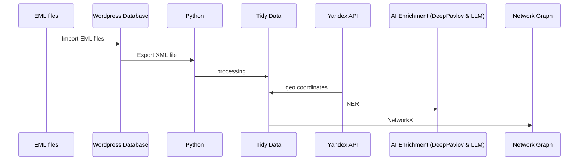

The data processing pipeline for the literary events dataset involved several stages, each crucial for transforming raw data into a structured and analyzable format. Here's a scheme:

## Data Model

1. Data Sourcing:
- Source: Electronic mail (EML) files uploaded to a WordPress site.
- Content: 1,157 issues of mailing lists containing event details, dates, places, and sources.
- Format: XML with HTML tags, inconsistent addresses, and typos.

2. Data Cleaning and Preprocessing:
- Regular expressions and filtering were used to remove unrelated sections and HTML tags.
- The cleaned data was structured into a CSV format with columns for event date, description, source, issue title, permalink, and publication date.
- Result: 44,930 records of events.

3. Duplicate Filtering:
- Fuzzy matching algorithms identified and eliminated duplicates.
- Outcome: 14,498 unique events.

4. Named Entity Recognition (NER):
- Natasha library extracted dates, addresses, and places, often marked with HTML tags.
- DeepPavlov library extracted persons' names.
- Pandas and difflib libraries standardized venue names and addresses.
- Result: A dataset with 14,498 literary events, 862 venues, 817 unique addresses, and a comprehensive list of names.

5. Geographical Coordinates Extraction:
- Yandex Geocoder API extracted geographical coordinates from standardized addresses.
- Outcome: Latitude and longitude coordinates for each unique address.

This pipeline effectively transformed a large volume of unstructured data into a clean, structured dataset suitable for further analysis and visualization. The use of various libraries and APIs ensured accurate extraction and standardization of key information, making the dataset a valuable resource for understanding literary events and their geographical distribution.